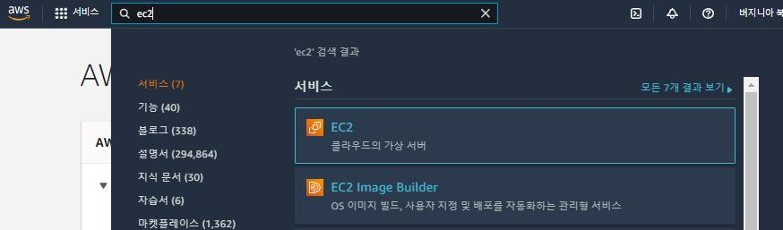

#### 참고

+ vim 명령어
  + i 버튼으로 수정모드로 전환
  + 방향키를 이용하여 이동
  + 수정
  + esc 로 수정모드 빠져나오기
  + :wq 명령어로 저장후 종료 (w 가 저장, q 가 종료)


### Deploy

<hr>


##### Cloud9(AWS 서비스) : 코드의 작성, 실행을 돕는 클라우드 IDE


+ AWS(https://aws.amazon.com/) 접속 후, cloud9 검색 후 클릭


+ Create environment 를 클릭하여 생성을 시작한다.


+ Project Name 을 설정 후 Next Step 으로 이동한다.


+ 프로젝트 상황에 맞게끔 설정을 한 후, Next Step 으로 이동한다.
+ Platform - Ubuntu Server 18.04 LTS
+ Cost-saving Setting - Never
+ 설정한 것을 확인한 이후, Create environment 로 Cloud9 서비스를 이용한다.


+ Cloud9 화면을 확인한다.


+ WSGI 인 gunicorn 과 Web Server 인 NGINX 를 활용하여 Client 도 사용할 수 있는 배포를 진행할 것이다.
+ Django 는 서버라고 했지만, 사실 어플리케이션을 만든 것이다. (run server 는 서버를 생성한 것이아닌, 개발용으로 경량용 서버를 만든 것이다.)
+ Django 는 웹서버의 HTTP 요청을 받을 수 없다.


+ Show Home in Favorites 를 클릭하여, Home 에서 진행한다.


+ Terminal 창은 항상 초기 위치에서 진행할 것이다.

```bash
$ cd ~
```

+ Cloud 9 는 컴퓨터에 접근하기위한 것. 컴퓨터는 EC2 라는 것을 활용할 것이다


##### EC2(AWS 서비스): 가상서버 역할을한다.



+ AWS 에서  EC2 를 검색하여 접속


+ 보안그룹으로 이동하여 설정을 해주여야한다.


+ 보안그룹 ID를 클릭하여 접근한다.


+ 화면 하단에 존재하는 인바이드 규칙 편집에 들어간다.

+ 컴퓨터에 접근 가능한 주소나 포트를 열어주어야한다.
+ 80번 포트 (HTTP 포트)
+ 8000번 포트(Django 에서 주로 쓰던 포트)


+ 0.0.0.0/0(Ipv4) ::/0(IPv6) 의 80번과 8000번 포트를 열어준다.

+ 해당 과정을 마친 뒤, 다시 Cloud 9 으로 돌아가 터미널에서 진행하게 된다.


##### 서버 설정

+ 리눅스에서 pyenv 를 활용하여 설치를 할 것이다.

+ 공식문서(https://github.com/pyenv/pyenv) 참고

```bash
git clone https://github.com/pyenv/pyenv.git ~/.pyenv
sed -Ei -e '/^([^#]|$)/ {a \
export PYENV_ROOT="$HOME/.pyenv"
a \
export PATH="$PYENV_ROOT/bin:$PATH"
a \
' -e ':a' -e '$!{n;ba};}' ~/.profile
echo 'eval "$(pyenv init --path)"' >>~/.profile

echo 'eval "$(pyenv init -)"' >> ~/.bashrc

```

+ 해당 코드를 복스하여 pyenv 설치하기


+ pyenv 버전 확인

```bash
pyenv -v
# 출력확인 -> pyenv 2.2.3-1-g423de9ae
```


+ python 설치(프로젝트에서 사용한 버전 설치)

```bash
pyenv install 3.9.6
pyenv global 3.9.6
python --version
```


##### Project Clone

+ 주의! 루트폴더와 프로젝트폴더, 두개의 이름을 주의하며 진행하기.
+ 두 폴더의 이름이 동일하면 조금 더 편하게 설정할 수 있다.


+ Clone 받기(Home 기준으로 진행)

```bash
cd ~
git clone [프로젝트 주소]
```

+ git 의 토큰문제가 발생한다.

```bah
remote: Support for password authentication was removed on August 13, 2021. Please use a personal access token instead.
remote: Please see https://github.blog/2020-12-15-token-authentication-requirements-for-git-operations/ for more information.
fatal: Authentication failed for 'https://github.com/MyselfSuhyun/sibback.git/'
```

+ 해결하기위해 git -> settings -> developer settings -> personal access tokens -> generate new token 로 생성된 토큰을 복사하여 password 대용으로 사용한다.
+ 


+ 폴더구조(아래와 같은 구조를 가지게 된다.)

```
home/
	ubuntu/
		(루트폴더) # (우리로 치면, SIB-back)
			(프로젝트폴더) (우리로 치면, back)
			(앱)
```

+ 현재 위치 확인하기

```bash
pwd
# 출력 /home/ubuntu
```


+ 루트폴더로 이동한 뒤, 가상 환경을 설치하고 pip 설치하기

```bash
cd back
python -m venv venv
source venv/bin/activate
pip install -r 'requirments.txt'
```


+ 마이그레이션 진행

```bash
python manage.py makemigrations
python manage.py migrate
python manage.py loaddata babies.json
```


+ Collectstatic

  + settings.py 수정

  ```python
  # SETTINGS.PY
  STATIC_ROOT = BASE_DIR/'staticfiles'
  ```

  + collectstatic

  ```bash
  python manage.py collectstatic
  ```

  

##### Gunicorn

+ 설치
  + https://docs.gunicorn.org/en/stable/install.html

```bash
pip install gunicorn
```


+ 서버실행

```bash
gunicorn --bind 0.0.0.0:8000 (프로젝트폴더).wsgi:application
gunicorn --bind 0.0.0.0:8000 back.wsgi:application
```


```bash
[2021-12-29 12:37:16 +0000] [6597] [INFO] Starting gunicorn 20.1.0
[2021-12-29 12:37:16 +0000] [6597] [INFO] Listening at: http://0.0.0.0:8000 (6597)
[2021-12-29 12:37:16 +0000] [6597] [INFO] Using worker: sync
[2021-12-29 12:37:16 +0000] [6598] [INFO] Booting worker with pid: 6598
```

+ http://0.0.0.0:8000 을 open 하면 django page 확인가능


+ 뜨는 주소를 settings.py 에 입력해준 뒤 재시작

```python
# settings.py
ALLOWED_HOSTS = [
        '' # 위의 주소를 입력해줄것
    ]

```


+ 아래 코드를 본인에 상황에 맞게 설정해주기(gunicorn 을 일일히 키기 귀찮으니까, 항시 실행으로 바꾸기 위한 코드)

```
[Unit]
Description=gunicorn daemon
After=network.target

[Service]
User=ubuntu
Group=www-data
WorkingDirectory=/home/ubuntu/[루트폴더]
ExecStart=/home/ubuntu/[루트폴더]/venv/bin/gunicorn \
		--workers 3 \
		--bind 127.0.0.1:8000 \
		[프로젝트폴더].wsgi:application
		
[Install]
WantedBy=multi-user.target
```


+ 파일 수정 하기

```bash
sudo vi /etc/systemd/system/gunicorn.service
```


+ 시스템 데몬 재시작

```bash
sudo systemctl daemon-reload
```


+ 서비스 실행 및 등록

```bash
sudo systemctl start gunicorn
sudo systemctl enable gunicorn
sudo systemctl status gunicorn.service

# active 가 돌아가면 잘되고 있다는뜻

# 중지
# sudo systemctl stop gunicorn
# 재시작
# sudo systemctl restart gunicorn
```


##### nginx

+ vim 을 사용하여 터미널의 파일을 수정한다.


+ 설치하기

```bash
sudo apt-get update
sudo apt-get install -y nginx

```


+ 아래 코드를 본인에 상황에 맞게 설정해주기

```
server {
	listen 80;
	server_name [서버주소];
	
	location /static/ {
		root /home/ubuntu/[루트폴더]/staticfiles/;
	}
	
	location / {
		include proxy_params;
		proxy_pass http://127.0.0.1:8000;
	}
}
```


+ 파일 수정하기

```bash
sudo vi /etc/nginx/sites-available/django_test
```


+ 사이트 추가

```bash
sudo ln -s /etc/nginx/sites-available/django_test /etc/nginx/sites-enabled
```


+ nginx , gunicorn 재시작

```bash
sudo systemctl restart nginx
systemctl status nginx.service
sudo systemctl restart gunicorn

```


+ 에러가발생함 이유? 포트가 중복되니까!
+ sudo lsof -t -i tcp:80 -s tcp:listen | sudo xargs kill


##### DNS

+ 도메인 결제후 진행한다.


#### Route53

+ 레코드 생성
  + 레코드 유형 - A
  + 값: EC2 퍼블릭IP


+ nginx 설정도 수정

```bash
sudo vi /etc/nginx/sites-available/django_test
```

```
server {
	listen 80;
	server_name [서버주소] [도메인주소];
	
	location /static/ {
		root /home/ubuntu/[루트폴더]/staticfiles/;
	}
	
	location / {
		include proxy_params;
		proxy_pass http://127.0.0.1:8000;
	}
}
```


+ settings.py 도 수정

```python
ALLOWED_HOSTS = [
        '' # 호스팅할 ip주소
        '' # 도메인주소
    ]
```


+ nginx , gunicorn 재시작

```bash
sudo systemctl restart nginx
sudo systemctl restart gunicorn

```


##### HTTPS

+ https://letsendcrypt.org/ko/getting-started/
+ Cerbot 사용을 권장한다

+ https://howhttps.works/ko/ 사이트에서 써야하는 이유를 보자!


##### cerbot

+ https://certbot.eff.org/


+ Software(nginx), System(Ubuntu) 선택 후 가이드를 진행하자


+ core 설치 후 cerbot 설치. 그 후 심볼릭 링크

```shell
sudo snap install core; sudo snap refresh core
sudo snap install --classic certbot
sudo ln -s /snap/bin/certbot /usr/bin/certbot
```


+ 자동설정

```shell
sudo certbot --nginx
```


+ 이메일 입력, 동의(y) 입력


+ 도메인 등록 (1. jwsh.link 를 등록할려면 1번 입력후 엔터)


+ EC2 보안그룹 탭 이동후 생성된 보안그룹 ID 클릭
  + 소스 0.0.0.0/0, ::/0 
  + 포트 443 
  + 을 80, 8000번에 이어 추가적으로 열어줌


+ https:// 을 입력하여 주소확인


+ frontend 에 주소 수정 후 배포하기

