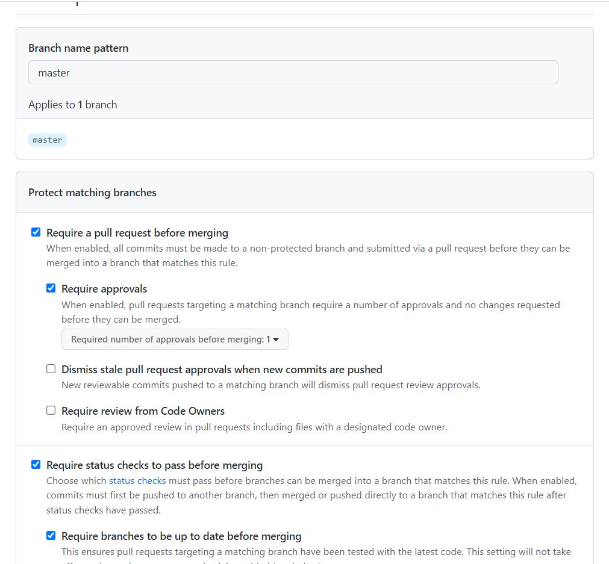
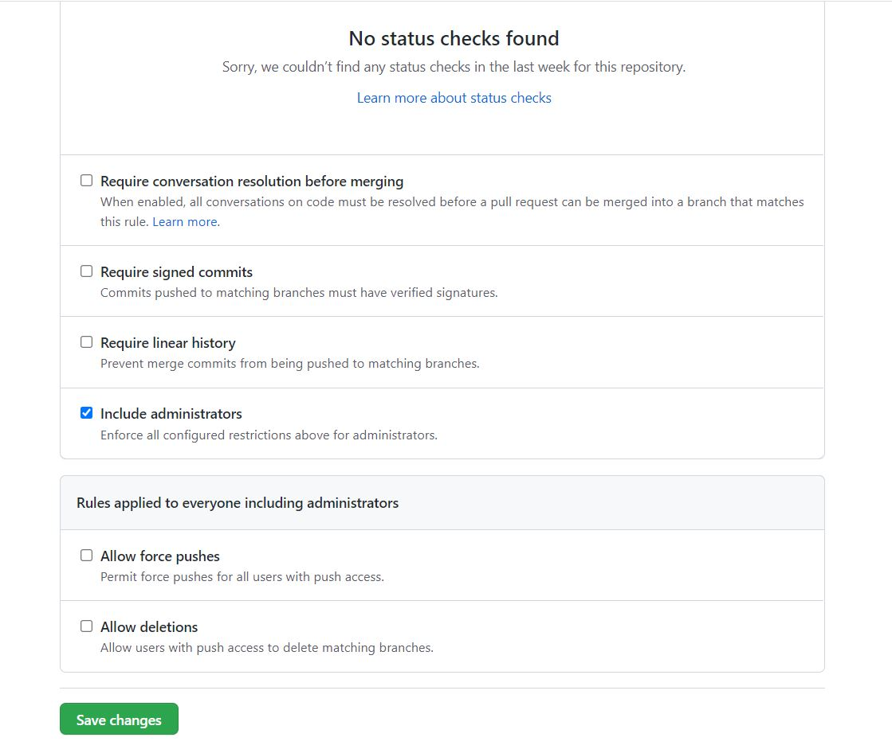
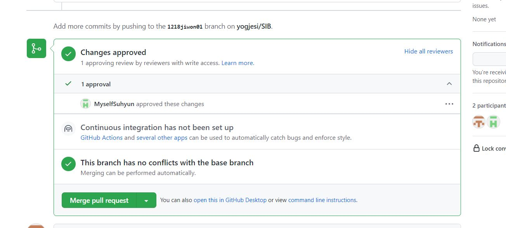
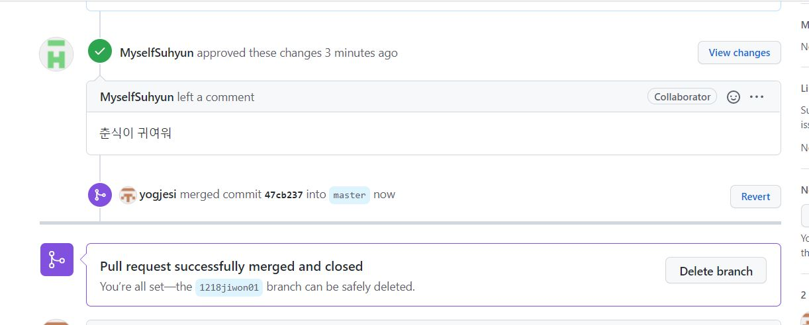

# Git  branch 할 때 주의사항

## branch 이름

- 이름의 중복을 피하기 위해 branch 이름에 규칙성 부여

  날짜 + 이름 + 번호

  ex) 1217 jiwon 01

  하루에 두 번 이상 커밋할 경우

  ex)1217 jiwon 02

## git branch protection

master branch에 관해서 다음과 같이 설정함:

- master branch에서 바로 push 불가능
- 각자의 branch에서 push한 후, 한 명 이상의 승인이 있어야 함
- 이때 승인은 리뷰를 필요로 함
- 충돌이 있는지 검사해줌
- 관리자도 예외사항없이 적용됨

참고한 사이트: https://cupjoo.tistory.com/11

## git push

- master에서 git push가 되지 않음 : 각자의 branch에서 git push 해야 함
- push한 내용이 바로 반영되지 않음 : pull request를 통해 최소 1명 이상이 타인의 pull request를 읽어보고 충돌을 확인한 후 승인해줘야 함
- 만일 이 부분이 불편하다면 조금 더 얘기해보는 걸로...!

## branch approve

다른 사람의 pull을 승인하는 방법은 다음과 같다.

- 1번 : Pull requests 버튼 클릭하면 위와 같은 창이 뜸
- 2번 : 확인/승인하고자 하는 pull request의 Compare & pull request 버튼을 클릭

- 승인되지 않은 경우 위와 같은 빨간 박스들이 뜸
- 3번: Add your review를 눌러서 이제 리뷰 및 승인을 하러 가자!(상단의 File changes를 눌러도 무방함)

- 상단의 Change review 버튼 누르기

- 코드나 주석 등을 읽고 간단한 리뷰를 남김(이 부분을 통해 피드백을 남겨줄 수 있다!)
- 이상이 없으면 승인하는데, 승인할 땐 꼭 하단의 radio checkbox에서 Approve를 선택할 것

- 꼭... 승인버튼... 잊지맙시다...
- Submit review를 눌러서 승인 완료!!!!

- 리뷰 승인이 되면 다음과 같이 뜸
- 병합까지 완료하기 위해서는 아래의 Merge pull request를 눌러주면 되는데, 이건 리뷰한 사람이 누를까요 아님 어떡할까요???

- 승인한 사람이 누구인지 확인할 수 있다...

- master에 Merge pull까지 완료되면 다음과 같은 상태가 된다.

## 과정 정리

- 각 팀원은 브랜치를 만들어서 푸쉬를 한다. 즉 git 입장에서는 각 팀원이 push한 것을 'pull' 하려는 상태.
- git에서 해당 브랜치의 작성자를 제외한 다른 팀원들에게 pull request를 요청
- 작성자 본인 외에 다른 팀원이 리뷰를 달고 승인을 해서 pull request를 허락해줌
- pull request가 되고 나면 master에 Merge pull을 해도 되는지 물어봄(Merge pull request)
- 그것까지 승인하면 master에 해당 브랜치가 병합되어 반영됨.(업데이트 됨.)

혹시 이해되시나여???

